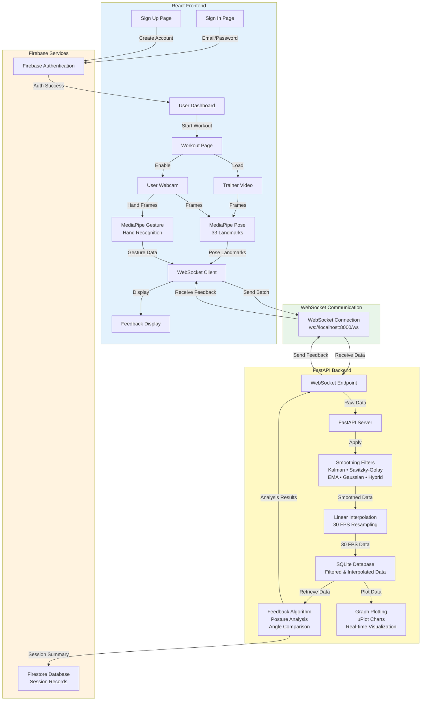

# System Architecture - Posture Correction & Workout Analysis

## Architecture Diagram



## Detailed System Flow

### 1. Authentication & User Management
**Sign In / Sign Up → Firebase**
- User enters credentials on Sign In or Sign Up page
- Firebase Authentication validates and creates user session
- Upon success, user is redirected to Dashboard
- User profile stored in Firestore

### 2. Workout Initialization
**Dashboard → Workout Page**
- User selects workout from Dashboard
- Workout page loads with:
  - **Trainer Video**: Pre-recorded reference video
  - **User Webcam**: Live camera feed

### 3. Pose & Gesture Detection
**MediaPipe Processing**
- **MediaPipe Pose**: Detects 33 body landmarks from both videos
- **MediaPipe Gesture**: Recognizes hand gestures from user webcam
- Calculates 15 joint angles with confidence scores
- Data batched every 1 second

### 4. Real-time Data Transmission
**WebSocket Communication**
- Frontend sends batched pose data via WebSocket
- Bidirectional connection maintains real-time sync
- Backend receives continuous stream of angle data

### 5. Backend Data Processing
**FastAPI Server Pipeline**

**Step 1: Smoothing Filters**
- Apply selected filter (Kalman, Savitzky-Golay, EMA, Gaussian, or Hybrid)
- Removes noise while preserving signal shape
- Improves data quality for analysis

**Step 2: Linear Interpolation**
- Resamples data to consistent 30 FPS
- Fills gaps between frames
- Ensures uniform temporal resolution

**Step 3: SQLite Storage**
- Stores filtered and interpolated data
- Maintains workout session history
- Enables data retrieval for analysis

### 6. Feedback Generation
**Feedback Algorithm**
- Retrieves data from SQLite database
- Compares user angles vs trainer angles
- Analyzes posture deviations
- Generates real-time feedback messages
- Calculates performance metrics

### 7. Visualization
**Graph Plotting**
- uPlot charts display real-time angle data
- Shows both raw and smoothed series
- 15 joint angle graphs
- Visual comparison of user vs trainer

### 8. Feedback Delivery
**WebSocket → Frontend**
- Backend sends feedback through WebSocket
- Frontend receives and displays corrections
- Real-time posture guidance shown to user
- Visual and text-based feedback

### 9. Session Storage
**Final Record → Firebase**
- After workout completion, feedback algorithm generates session summary
- Summary includes:
  - Performance scores
  - Posture accuracy metrics
  - Exercise completion data
  - Timestamp and duration
- Stored in Firestore for user history

## Technology Stack

### Frontend
- **React**: UI framework
- **MediaPipe**: AI pose and gesture detection
- **WebSocket Client**: Real-time communication

### Backend
- **FastAPI**: Python web framework
- **WebSocket Server**: Bidirectional communication
- **NumPy/SciPy**: Signal processing for filters
- **uPlot**: High-performance charting

### Databases
- **Firebase Auth**: User authentication
- **Firestore**: Session records and user profiles
- **SQLite**: Temporary storage for filtered/interpolated data

## Data Flow Summary

```
1. User Login (Firebase Auth) → Dashboard
2. Start Workout → Load Trainer Video + User Webcam
3. MediaPipe detects poses → Calculate angles
4. Send data via WebSocket → FastAPI Backend
5. Apply Filters → Linear Interpolation → Store in SQLite
6. Feedback Algorithm analyzes data
7. Plot graphs (uPlot) for visualization
8. Send feedback via WebSocket → Display on Frontend
9. Store final session record in Firestore
```
